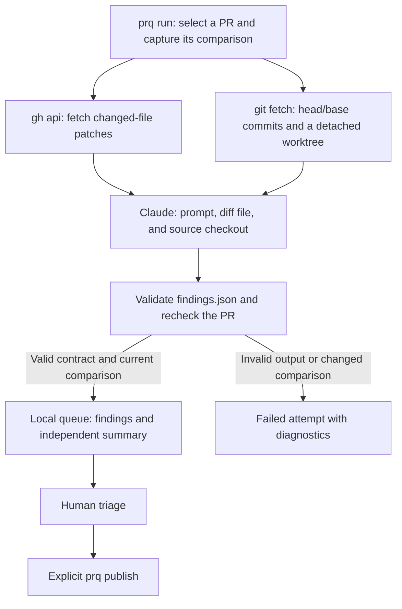

# How prqueue works

Prqueue fetches PR information and changes from GitHub, prepares a fresh source checkout, and asks Claude Code to review that captured comparison. Claude writes proposed findings to a file. Prqueue validates those findings and stores them locally for human triage; publishing is a separate, explicit operation.

This overview describes the implemented application. The [v1 specification](../prqueue-spec.md) defines the detailed behavior.



## 1. Select the PR and capture the changes

`prq run` checks configuration, required tools, agent consent, and GitHub identity. It uses `gh api` to list open PRs, then records observed head/base commits, draft status, and PR state before applying filters. Previously tracked PRs missing from a complete list are fetched directly; absence alone never means closure.

Eligible comparisons that have already been reviewed successfully are skipped. A selected `--pr` forces a fresh review, including a draft, while closed or merged PRs remain excluded.

For each review, prqueue fetches the PR's changed files through GitHub's paginated `/repos/{repo}/pulls/{number}/files` endpoint. It saves their patches in `comparison.diff`, including diagnostics when an inline anchor cannot be verified from the supplied patch. See the [GitHub client](../internal/github/client.go).

## 2. Create a fresh repository checkout

The [runner](../internal/runner/runner.go) creates a new bare Git repository for each attempt, adds the GitHub repository as its remote, and fetches the exact captured head and base SHAs. It then creates a detached worktree at the PR's head commit.

Claude runs with that worktree as its current directory. The normal tracked source tree is available, including unchanged files, so it can inspect surrounding code, tests, and fetched Git history. The runner does not use the user's working checkout as its review directory.

The source is available on disk for Claude to explore; the entire repository is not inserted into the prompt. PR descriptions, discussion comments, and previous GitHub reviews are not currently supplied. The runner also does not automatically install project dependencies or initialize submodules.

## 3. Invoke Claude with the supplied diff

Prqueue handles PR discovery and GitHub reads. The agent is instructed to review the supplied comparison and relevant local source, and explicitly told not to invoke `gh`, publish, commit, push, or modify source.

The argument list is equivalent to the following, where `$run_id` is the attempt's UUID:

```sh
claude -p --verbose --output-format stream-json \
  --no-session-persistence \
  --session-id "$run_id" \
  --dangerously-skip-permissions
```

The Go runner starts the configured `agent.executable` directly, sets its working directory to the detached checkout, and feeds the prompt through stdin. It captures stdout in `agent.jsonl` and stderr in `agent-stderr.log`. No model is selected by prqueue; Claude uses its configured default. The configured timeout covers worktree setup and agent execution, and configured parallelism limits concurrent reviews.

The [prompt template](../internal/runner/prompt.go) supplies:

- Repository, PR number, captured head SHA, and base SHA.
- Absolute paths to `comparison.diff` and the required `findings.json` output.
- Instructions to read relevant source, run focused tests/builds when useful, and report concrete problems introduced by the change.
- The JSON contract, permitted finding types/categories/severities, inline-anchor rules, and size limits.

The runner also sets `PRQUEUE_INPUT` to the repo/PR/head identity JSON and `PRQUEUE_OUTPUT` to the output path. It removes GitHub token environment variables from the agent environment, while retaining model authentication. Claude still has full user permissions and can access ambient GitHub authentication: these prompt restrictions are not an enforced sandbox. This is the access acknowledged during `prq init`.

## 4. Validate and ingest findings

Claude must write `findings.json`; the streamed stdout transcript is retained as diagnostics. After the process exits successfully, prqueue checks the reviewed HEAD and validates the output file. The [contract validator](../internal/findings/findings.go) requires a single valid UTF-8 JSON document with the expected fields, supported values, and exact repo/PR/head identity. Limits are 4 MiB per file, 100 findings, and 60,000 UTF-8 bytes per body or summary.

Prqueue then re-fetches live PR state. If head, base, draft status, or PR state changed during the review, the attempt fails without activating that output. Otherwise it validates inline locations against the captured diff and ingests the findings, audit records, and successful-review marker atomically. The summary becomes its own queue item requiring separate approval. Existing decisions are preserved only under the spec's fingerprint, exact-body, anchor, and comparison rules.

## 5. What happens when output is invalid

There are two different outcomes:

| Problem | Result |
| --- | --- |
| Missing/nonregular output file, malformed JSON, missing/unknown fields, invalid types/enums, wrong repo/PR/head, or exceeded limits | The entire PR review attempt fails. None of that output is ingested. |
| A structurally valid finding has an inline location that cannot be verified against the diff | That finding is retained as `blocked` with its validation reason; the rest of the valid document can be ingested. |

For example, an inline finding missing its required `side` fails the contract for the whole document. An inline finding with a valid shape but a line outside the diff becomes blocked. A blocked finding needs an explicit human correction/conversion before approval; prqueue does not silently relocate it or convert it to general.

For a normal run with a file/contract failure:

- Record the attempt as failed, with the validation error and a failure audit event.
- Leave the successful-review marker unadvanced and do not replace or obsolete existing findings using the invalid output. Approval invalidation already caused by an observed PR change still applies.
- Retain whatever output and diagnostic files were produced, and clean up the worktree.
- Continue other selected PRs and return exit code `2` for the run's review failures. Report failures in the run output and `prq status`; a new failure can also trigger the configured desktop notification.

There is no automatic repair pass or immediate agent retry. The validation error is not sent back to Claude. A new eligible comparison remains retryable on a later run; a forced rerun of a previously successful comparison may still be skipped by a subsequent ordinary run because the previous successful marker remains valid. To explicitly request another attempt:

```sh
./bin/prq status
./bin/prq run --repo DustinVK/pr-queue --pr 2
```

Replace the repository and PR number as needed. This starts a fresh agent review; there is no command to import a manually repaired output file.

## 6. Triage locally, then publish

Use `list`, `show`, and `diff` to inspect findings, then `edit`, `approve`, or `reject` to make local decisions. An edit clears approval. Approval verifies the authenticated account, current PR eligibility/comparison, and complete anchor, and records the exact approved body.

`prq publish` revalidates the selected approvals and sends one submitted GitHub review with a human-selected event. Frozen publication snapshots let recovery reconcile uncertain delivery while preserving later local edits and decisions. The [interactive review proposal](interactive-review-plan.md) adds a terminal prompt around local triage; it is not implemented yet.

## Files and dry runs

During a normal review, the main files are:

```text
~/.local/state/prqueue/
  queue.db
  runs/<run-id>/
    comparison.diff
    prompt.txt
    findings.json
    agent.jsonl
    agent-stderr.log
  worktrees/<run-id>/
    repo.git/
    checkout/
```

The runner also records Git diagnostics. Worktrees and their ownership metadata are cleaned after successful or failed attempts; normal startup recovery handles abandoned worktrees after an interruption. Run diagnostics remain available for inspection.

`run --dry-run` still invokes Claude and can incur model cost, but uses temporary artifacts and an in-memory copy of the queue. It persists no run/observation/finding changes or run-summary update, makes no coordinator GitHub writes, and sends no notification. Its temporary artifacts are removed afterward. `publish --dry-run` performs a read-only preview of the exact proposed publication request.
